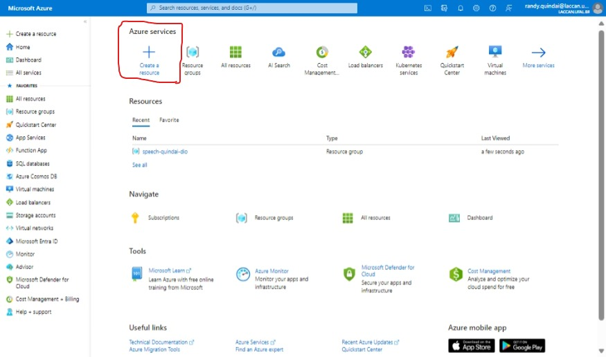

# Mineração de Conhecimento e Inteligência de Documento com Microsoft Azure AI
Vamos explorar o serviço Azure AI Search index (UI) num caso de uso através de um passo-a-passo com etapas simples.

Aqui iremos fazer o seguinte:
1. [Criar um recurso Azure](#1-criar-um-recurso-azure)
2. [Extrair dados de um *datasource*](#2-extrair-dados-de-um-datasource)
3. Enriquecer os dados com habilidades de IA
4. Usar o indexer do Azure no portal Azure
5. Realizar busca no indexer criado
6. Revisar os resultados armazenados numa loja de Conhecimento

Os serviços que precisamos para realizar essa tarefa são o **Azure AI Search** para gerenciar a indexação e buscas, o **Azure AI Services** para consumir os serviços de IA que vão enriquecer os dados e o **Storage Account** que será o nosso *container* de documentos.

## 1. Criar um recurso Azure
| Login no [Portal Azure](https://portal.azure.com/learn.docs.microsoft.com?azure-portal=true) e Criação de um Recurso |                       
| ----------------------------------- |
|  |

| Após isso, pesquise **Azure AI Search** e selecione `Criar` em **Azure AI Search** |                       
| ----------------------------------- |
|  |

| Insira o seu grupo de recursos, nome do serviço e Pricing Tier, finalmente clique em revisar e criar |                       
| ----------------------------------- |
|  |

Verifique se todas as informações estão corretas e aguarde a criação do seu recurso.

| Serviço criado | SLA - Service Level Agreement |                           
| ----------------------------------- | ----------------------------------- |
|  |  |

Um Acordo de Nível de Serviço (SLA, do inglês Service Level Agreement) é um contrato formal estabelecido entre um prestador de serviços e um cliente. Ele define os níveis de serviço que o provedor se compromete a entregar ao cliente em termos de qualidade, disponibilidade, desempenho, suporte e outros aspectos relevantes do serviço. Observe que, como escolhi o Free Tier a plataforma Azure comunica que não existe um SLA entre o meu recurso e a plataforma.

Os SLAs são elaborados com base nas necessidades e expectativas do cliente e servem como um meio de garantir que ambas as partes tenham uma compreensão clara e mútua das responsabilidades, obrigações e metas relacionadas ao serviço. Eles geralmente incluem os seguintes elementos:

* Objetivos de desempenho: Definem métricas mensuráveis que o provedor de serviço deve alcançar, como tempo de resposta, tempo de atividade do sistema, tempo de resolução de problemas, etc.

* Responsabilidades do provedor de serviço: Especificam as ações e responsabilidades do provedor para garantir o cumprimento dos níveis de serviço acordados.

* Responsabilidades do cliente: Descrevem as responsabilidades e ações que o cliente deve cumprir para garantir que o serviço seja fornecido efetivamente.

* Processo de monitoramento e relatórios: Estabelecem os métodos e frequência de monitoramento do desempenho do serviço, bem como a maneira pela qual os relatórios serão gerados e compartilhados entre as partes.

* Procedimentos de escalonamento: Indicam os procedimentos a serem seguidos em caso de não cumprimento dos níveis de serviço acordados, incluindo como e quando as partes devem comunicar e resolver problemas.

* Compensação e penalidades: Especificam quaisquer compensações ou penalidades que serão aplicadas caso o provedor de serviço não cumpra os níveis de serviço acordados.

Os SLAs são fundamentais para estabelecer expectativas claras, garantir a qualidade do serviço e promover a transparência e a confiança entre o provedor de serviço e o cliente. Eles são comumente usados em uma variedade de setores, incluindo tecnologia da informação, telecomunicações, serviços financeiros e muito mais.

:rotating_light: **Importante:** Você precisa provisionar o `Azure AI Services` na mesma localização que o recurso `Azure AI Search` para funcionar.

| Criar o serviço Azure AI Services | Criar o serviço Azure AI Services com o mesmo Resource Group e localizado na mesma Região | Recurso Criado |                      
| ----------------------------------- | ----------------------------------- | ----------------------------------- |
|  |  |  |

| Criando o Serviço de Azure Storage | Revisar e criar o recurso |                           
| ----------------------------------- | ----------------------------------- |
|  |  |

Na conta do **Azure Storage**, no painel à esquerda selecione `Configuração` no menu `Definições`, mude para `Allow Blob anonymous access` e salve.
| Ativando o acesso à BLOB 1 | Ativando o acesso à BLOB 2 |                      
| ----------------------------------- | ----------------------------------- |
|  | 

## 2. Extrair dados de um *datasource*
Inicialmente você precisa importar os `datasets`. Vamos usar os arquivos disponíveis em `https://aka.ms/mslearn-coffee-reviews`, baixar e importar os dados no [Portal da Azure](https://portal.azure.com/learn.docs.microsoft.com?azure-portal=true).

| Carregando Dados para Processamento 1 | Carregando Dados para Processamento 2 |                      
| ----------------------------------- | ----------------------------------- |
|  | 

| Carregando Dados para Processamento 3 | Carregando Dados para Processamento 4 |                      
| ----------------------------------- | ----------------------------------- |
|  | 

Após o carregamento dos documentos, podemos dar início ao processamento com o `Azure AI Search` para extrair *insights* dos documentos.

